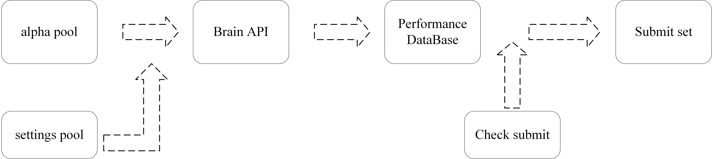
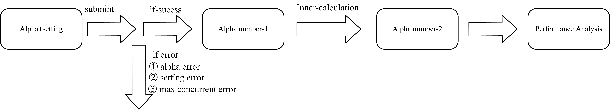

# PyWorldQuant

[](https://github.com/whosquant/pyworldquant/actions?query=workflow%3Abuild)  [](https://github.com/whosquant/pyworldquant/viztracer/actions?query=workflow%3ALint)   [](https://github.com/whosquant/pyworldquant/blob/master/LICENSE)  [](https://github.com/whosquant/pyworldquant/commits/master)  

PyWorldQuant is a helper for WorldQuant Brain Member that can automatically submit alpha factors in the [WorldQuant Brain Platform](https://platform.worldquantbrain.com/).

It is also my early version of research job. In this project,i use multiprocess and Brain API to make my research on Brain Platform more easily and efficiently. May the code be helpful to anyone who wants to do research on Brain Platform.
## Documentation

- **[Quick start guide 🚀](./docs/GETTING-STARTED.md)**
- **[Official API documention 📡](https://platform.worldquantbrain.com/learn/documentation/consultant-information/brain-api)**

## Project Structure

```sh
pyworldquant/
|-- alpha_generator
|   |-- alpha_workshop.py
|   |-- alphapool.csv
|-- doc
|-- data
|-- LICENSE
|-- README.md
|-- requirements.txt
|-- alphatest.py
```


## Brief WorkFlow
### alpha workfow


### Brain Platform workflow


## Quick Start

1,fill in your own usename and key in config.py.

2,choose your research settinglist in settinglist which also located in config.py. If you do not have preference in region and universe,you can use the default setting.

3,build your own alphapool by creating your own alpha generator.If you do not have preference, you can try my alphapool demo as first try.

4,install the necessary package

```sh
pip install -r requirement.txt
```

5, run the alphatest.py

```sh
python3 alphatest.py 
```

## TO be continued
If you like WorldQuant Brain or you love crypto,you can contact me with more. 

Dont forget to give me a star,if get more stars than 100,i will develop the next version of alpha excavator and the performance analyzer.

